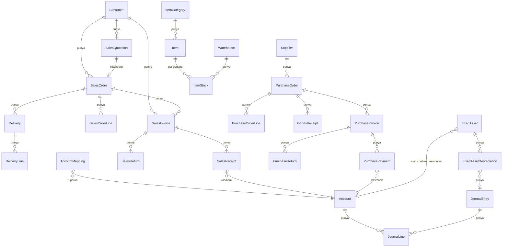
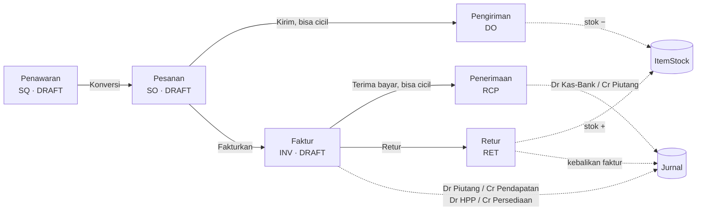
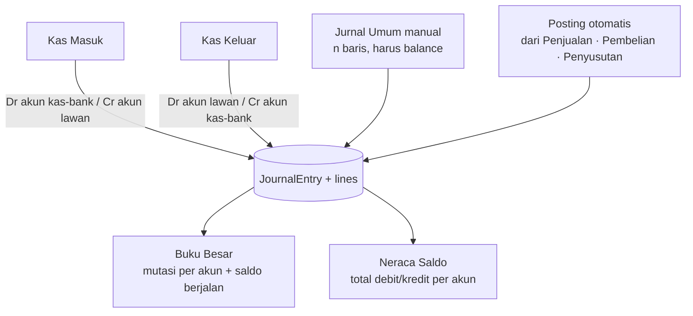
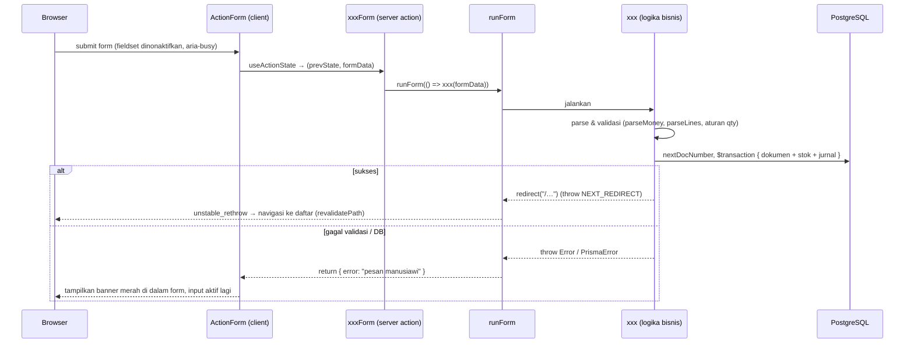

# Arsitektur Accurate Copy

Dokumen ini menjelaskan **bagaimana sistem disusun** dan **bagaimana data mengalir** dari layar sampai ke buku besar. Dibaca berurutan dari atas ke bawah: gambaran besar → struktur kode → model data → alur tiap modul → mekanisme lintas modul (penomoran, stok, jurnal, error) → operasional.

Dokumen pendamping: `README.md` (cara menjalankan & konvensi), `AUDIT.md` (temuan audit & pekerjaan terbuka).

---

## 1. Gambaran besar

Accurate Copy adalah aplikasi web internal yang meniru **alur kerja** software akuntansi Accurate 5 — bukan kodenya. Satu proses Next.js melayani UI sekaligus logika bisnis (server actions), dengan PostgreSQL sebagai satu-satunya sumber kebenaran.


**Stack:** Next.js 16.3 (App Router, React 19 `useActionState`), TypeScript, Tailwind CSS v4, Prisma ORM 7.10 dengan driver adapter `@prisma/adapter-pg`, PostgreSQL 18.4 lokal, `tsx` untuk skrip.

**Prinsip desain yang dipegang:**

1. **Satu transaksi = satu perubahan keadaan yang utuh.** Setiap dokumen yang mengubah stok atau saldo (pengiriman, faktur, pembayaran, retur, penyusutan) dibuat di dalam `db.$transaction` bersama efek sampingnya. Tidak pernah ada faktur tanpa jurnal, atau pengiriman tanpa pengurangan stok.
2. **Server yang memvalidasi, client hanya membantu.** Semua aturan bisnis ada di server action; komponen client (`LineItemsEditor`, dll.) cuma menyusun input dan menampilkan preview.
3. **Angka uang & kuantitas selalu `Prisma.Decimal`** di server. `Number` hanya untuk tampilan.
4. **Error dikembalikan, bukan dilempar, ke UI.** Lihat §7.
5. **Konfigurasi di atas kode berulang** untuk master data (satu halaman generik untuk 9 entitas).

---

## 2. Struktur kode

```
app/
├─ prisma/
│  ├─ schema.prisma          # seluruh model data (§3)
│  ├─ migrations/            # riwayat migrasi, termasuk CHECK constraint stok
│  ├─ seed.ts                # 1 alur cerita 20 tahap yang melewati semua modul
│  └─ reset.ts               # kosongkan semua tabel (urutan aman terhadap FK)
├─ scripts/
│  └─ e2e-test*.ts           # 5 suite regresi: sales, purchasing, ledger, assets, guards
├─ src/
│  ├─ app/                   # routing (App Router)
│  │  ├─ layout.tsx          # kerangka: Sidebar + <main>
│  │  ├─ page.tsx            # dashboard
│  │  ├─ error.tsx · not-found.tsx · loading.tsx
│  │  ├─ master/[entity]/    # SATU halaman generik untuk semua master data
│  │  ├─ sales/…             # quotations, orders, deliveries, invoices, receipts, returns
│  │  ├─ purchasing/…        # orders, receipts, invoices, payments, returns
│  │  ├─ cashbank/…          # in, out
│  │  ├─ ledger/…            # journal, general-ledger, trial-balance
│  │  ├─ assets/…            # daftar aset, depreciation
│  │  ├─ settings/account-mapping/
│  │  └─ api/health/         # cek koneksi DB
│  ├─ components/
│  │  ├─ Sidebar.tsx         # accordion 7 menu + drawer mobile (client)
│  │  ├─ ActionForm.tsx      # pembungkus form: error state, pending, konfirmasi (client)
│  │  ├─ sales/*Picker.tsx, LineItemsEditor.tsx   # editor baris (client)
│  │  ├─ purchasing/ReceiptLinesPicker.tsx
│  │  └─ ledger/JournalLinesEditor.tsx, AccountSelect.tsx
│  ├─ lib/
│  │  ├─ db.ts               # singleton PrismaClient + adapter pg
│  │  ├─ masterConfig.ts     # definisi entitas master data (field, kolom, section)
│  │  ├─ money.ts            # Decimal helpers: D, money, sum, mul, parseMoney, fmt
│  │  ├─ numbering.ts        # nextDocNumber(delegate, prefix)
│  │  ├─ stock.ts            # decrementStock (cek ketersediaan), incrementStock
│  │  ├─ accounting.ts       # aturan posting jurnal otomatis (§6)
│  │  ├─ formState.ts        # runForm: ubah error → state, terjemahkan error Prisma
│  │  └─ actions/            # "use server": master, sales, purchasing, journal, fixedAssets, settings
│  └─ generated/prisma/      # output Prisma Client (di-gitignore, dibuat oleh `prisma generate`)
├─ AUDIT.md · ARCHITECTURE.md · README.md
└─ prisma7.config.ts · .env (DATABASE_URL, tidak di-commit)
```

**Lapisan & arah ketergantungan** (hanya boleh ke bawah):

| Lapisan | Isi | Boleh mengimpor |
|---|---|---|
| Halaman (`src/app`) | Server Components: query baca, susun props, render | components, lib/db, lib/actions |
| Komponen client (`src/components`) | Interaksi: editor baris, form, sidebar | tipe saja; **tidak** boleh `db` |
| Actions (`src/lib/actions`) | Validasi input, orkestrasi transaksi, redirect | lib/* |
| Domain (`src/lib/{money,stock,accounting,numbering}`) | Aturan bisnis murni yang dipakai lintas modul | lib/db (tipe), Prisma |
| Data (`src/lib/db.ts`, Prisma) | Akses DB | — |

---

## 3. Model data

Skema dibagi lima kelompok. Semua nilai uang/qty `Decimal(18,2)`; semua id `cuid`; setiap dokumen punya `no` unik (§5).



### 3.1 Master data (`Daftar` & `Persediaan`)
`Department`, `Employee`, `Customer` (punya sales), `Supplier`, `Project`, `Warehouse`, `ItemCategory` (pohon), `Item` (`type` BARANG/JASA, `costPrice`, `sellPrice`, `minStock`), `Account` (bagan akun, `type` ASET/KEWAJIBAN/MODAL/PENDAPATAN/BEBAN, pohon).

Semua dikelola oleh **satu halaman generik** `/master/[entity]` yang membaca `masterConfig.ts`:

```ts
{ slug: "customers", label: "Pelanggan", model: "customer", section: "daftar",
  fields: [{ name: "code", type: "text", required: true }, { name: "salesId", type: "select",
            options: { model: "employee", valueField: "id", labelField: "name" } }, …],
  columns: [{ key: "code" }, { key: "sales.name" }] }
```
Menambah entitas master baru = menambah satu objek konfigurasi; tidak ada halaman baru.

### 3.2 Stok
`ItemStock` berkunci komposit `(itemId, warehouseId)` — stok selalu **per gudang**. Constraint DB `CHECK (qty >= 0)`.

### 3.3 Dokumen transaksi
Pola seragam **header + baris**: header punya `no`, `date`, `status`, `total`, relasi pihak (customer/supplier) dan relasi ke dokumen asal; baris punya `itemId`, `qty`, `price`. Baris pesanan juga menyimpan **progres**: `qtyShipped`/`qtyReceived` dan `qtyInvoiced` — inilah yang membuat pengiriman & penagihan bisa dicicil dan divalidasi.

Status (`DocStatus`): `DRAFT` → `PARTIAL` → `PROCESSED` untuk pesanan (berdasar qty terkirim/diterima); `DRAFT` → `PARTIAL` → `PAID` untuk faktur (berdasar pembayaran); `DRAFT` → `CONVERTED` untuk penawaran.

### 3.4 Buku besar
`JournalEntry` (`no`, `date`, `memo`, `source`: MANUAL/KAS_MASUK/KAS_KELUAR/PENJUALAN/PEMBELIAN/PENYUSUTAN) dan `JournalLine` (`accountId`, `debit`, `credit`). Setiap entry **wajib balance** — dijaga di aplikasi (§6). `AccountMapping` adalah **singleton** (`id = "default"`) yang memetakan 5 peran akun: Piutang Usaha, Persediaan, HPP, Pendapatan Penjualan, Utang Usaha.

### 3.5 Aset tetap
`FixedAsset` (harga perolehan, nilai sisa, umur bulan, 3 akun) dan `FixedAssetDepreciation` (unik per `assetId + period`, terhubung ke jurnalnya).

---

## 4. Alur tiap modul

### 4.1 Penjualan



| Tahap | Halaman | Action | Validasi utama | Efek |
|---|---|---|---|---|
| Penawaran | `/sales/quotations/new` | `createQuotation` | pelanggan, ≥1 baris qty>0 | — |
| Konversi | tombol di daftar penawaran | `convertQuotationToOrder` | belum `CONVERTED` | buat SO, penawaran → `CONVERTED` |
| Pesanan langsung | `/sales/orders/new` | `createOrder` | idem penawaran | — |
| Pengiriman | `/sales/deliveries/new?orderId=` | `createDelivery` | qty ≤ sisa pesanan; **stok cukup** | stok −, `qtyShipped` +, status SO |
| Faktur | `/sales/invoices/new?orderId=` | `createInvoice` | qty ≤ sisa belum ditagih | `qtyInvoiced` +, **jurnal** |
| Penerimaan | `/sales/receipts/new?invoiceId=` | `createReceipt` | pilih akun kas/bank; ≤ sisa tagihan; belum lunas | status faktur, **jurnal** |
| Retur | `/sales/returns/new?invoiceId=` | `createReturn` | qty ≤ faktur − retur sebelumnya | stok +, **jurnal** |

Catatan desain: **stok berkurang saat pengiriman, bukan saat pesanan** (pesanan hanya reservasi logis), dan **faktur boleh mendahului pengiriman** (dua jalur, seperti Accurate).

### 4.2 Pembelian — cermin dari penjualan

```mermaid
flowchart LR
    PO[Pesanan Pembelian<br/>PO] -->|Terima barang, bisa cicil| GR[Penerimaan Barang<br/>GR]
    PO -->|Fakturkan| PINV[Faktur Pembelian<br/>PINV]
    PINV -->|Bayar, bisa cicil| PP[Pembayaran<br/>PP]
    PINV -->|Retur| PRET[Retur Pembelian<br/>PRET]
    GR -.->|stok +| STK[(ItemStock)]
    PRET -.->|stok − (cek cukup)| STK
    PINV -.->|Dr Persediaan / Cr Utang| GL[(Jurnal)]
    PP -.->|Dr Utang / Cr Kas-Bank| GL
    PRET -.->|Dr Utang / Cr Persediaan| GL
```

Action: `createPurchaseOrder`, `createGoodsReceipt`, `createPurchaseInvoice`, `createPurchasePayment`, `createPurchaseReturn` (`src/lib/actions/purchasing.ts`). Aturan validasi identik dengan penjualan dengan arah stok terbalik. Harga default di editor baris = `costPrice` barang.

### 4.3 Kas & Bank dan Buku Besar



- **Saldo normal** dihitung dari tipe akun: ASET & BEBAN normal **debit** (saldo = debit − kredit); KEWAJIBAN, MODAL, PENDAPATAN normal **kredit**.
- Kas Masuk/Keluar hanyalah jurnal 2 baris dengan `source` khusus, sehingga muncul di halaman masing-masing dan tetap konsisten dengan Buku Besar.
- `Pemetaan Akun` (`/settings/account-mapping`) **wajib diisi** sebelum faktur/penerimaan/pembayaran/retur bisa dibuat; jika kosong, action menolak dengan pesan yang mengarahkan ke halaman itu.

### 4.4 Aset Tetap

1. Daftarkan aset (`createFixedAsset`): harga perolehan, nilai sisa (< harga), umur bulan, 3 akun berbeda. *Perolehan tidak dijurnal otomatis* — diasumsikan sudah dicatat via Kas Keluar/Jurnal Umum.
2. `Jalankan Penyusutan` untuk satu periode `YYYY-MM` (`runMonthlyDepreciation`): untuk setiap aset AKTIF yang **belum** punya penyusutan di periode itu, hitung garis lurus `(perolehan − sisa) / umur`, dibatasi sisa nilai yang bisa disusutkan (bulan terakhir mengambil sisa agar total pas), lalu buat **satu** jurnal gabungan `JU-PNY` (Dr Beban Penyusutan / Cr Akumulasi Penyusutan per aset) dan catatan `FixedAssetDepreciation`. Unik `assetId+period` mencegah dobel-jalan.
3. Nilai buku di daftar aset = perolehan − Σ penyusutan.

---

## 5. Penomoran dokumen

`nextDocNumber(delegate, prefix)` → `PREFIX-TAHUN-NNNN`, mengambil **nomor terakhir** dengan awalan itu lalu +1 (bukan `count()+1`, yang bentrok setelah ada penghapusan). Kolom `no` unik di DB, jadi bila dua request bersamaan menghasilkan nomor sama, yang kedua ditolak — bukan duplikat diam-diam.

| Prefix | Dokumen | | Prefix | Dokumen |
|---|---|---|---|---|
| SQ / SO / DO / INV / RCP / RET | siklus penjualan | | JU · KM · KK | jurnal manual, kas masuk, kas keluar |
| PO / GR / PINV / PP / PRET | siklus pembelian | | JU-INV · JU-RCP · JU-RET · JU-PINV · JU-PP · JU-PRET · JU-PNY | jurnal otomatis |

---

## 6. Mekanisme lintas modul

### 6.1 Stok (`src/lib/stock.ts`)
`decrementStock(tx, itemId, warehouseId, qty, label)` membaca stok di dalam transaksi, menolak bila kurang ("Stok X tidak cukup (tersedia…, diminta…)"), lalu `decrement`. Pengaman balapan: `CHECK (qty >= 0)` di DB — bila dua transaksi lolos cek aplikasi bersamaan, yang kedua gagal dan seluruh transaksinya di-rollback; pesannya diterjemahkan oleh `formState.ts`. `incrementStock` memakai `upsert` (baris stok dibuat saat pertama kali ada barang masuk ke gudang itu).

### 6.2 Posting jurnal otomatis (`src/lib/accounting.ts`)

| Peristiwa | Debit | Kredit |
|---|---|---|
| Faktur Penjualan | Piutang Usaha (total) · HPP (Σ qty×costPrice) | Pendapatan Penjualan (total) · Persediaan (HPP) |
| Penerimaan Penjualan | Akun kas/bank yang dipilih | Piutang Usaha |
| Retur Penjualan | Pendapatan (nilai retur di harga faktur) · Persediaan (cost) | Piutang Usaha · HPP |
| Faktur Pembelian | Persediaan (total) | Utang Usaha (total) |
| Pembayaran Pembelian | Utang Usaha | Akun kas/bank yang dipilih |
| Retur Pembelian | Utang Usaha (nilai retur di harga faktur) | Persediaan |
| Penyusutan | Beban Penyusutan (per aset) | Akumulasi Penyusutan (per aset) |

Semua posting terjadi **di dalam transaksi yang sama** dengan dokumen sumbernya. Data seed dibuat langsung ke DB (tanpa melewati action) sehingga transaksi seed tidak punya jurnal otomatis — hanya jurnal contoh yang sengaja ditambahkan.

### 6.3 Uang & kuantitas (`src/lib/money.ts`)
`money()` membulatkan ke 2 desimal half-up; `parseMoney()` memvalidasi input form (wajib, angka valid, tidak negatif, default > 0); `sum`/`mul` mengembalikan Decimal. Perbandingan status (mis. lunas) memakai `.gte()`, bukan `>=` float.

---

## 7. Siklus hidup satu request (form → DB → layar)



Mengapa dua versi action (`createInvoice` dan `createInvoiceForm`)? Di production Next.js **menyamarkan** pesan error yang dilempar server action (anti-bocor data). Satu-satunya cara pesan validasi sampai ke user adalah **mengembalikannya sebagai state**. Versi tanpa akhiran `Form` tetap dipakai skrip regresi (yang justru ingin exception).

Halaman **daftar** adalah Server Component: query Prisma langsung, tanpa API layer; `revalidatePath` di action membuat daftar segar setelah redirect. Halaman **buat** memuat opsi (pelanggan, barang, gudang) di server dan menyerahkan input dinamis ke komponen client yang menyimpan baris sebagai JSON di `<input type="hidden" name="lines">`.

Boundary: `error.tsx` (kegagalan render, tombol coba lagi), `not-found.tsx` (`notFound()` dari master entity yang tidak dikenal), `loading.tsx` (skeleton saat navigasi).

---

## 8. Antarmuka

Tampilan mengikuti design system **"Precision Ledger"** dari paket Stitch (`DESIGN.md` + 2 layar contoh: Dashboard dan form Faktur). Implementasinya ada di `src/app/globals.css` (token & kelas komponen) dan `src/components/{AppShell,Sidebar,Topbar,InvoiceComposer,ui/*}`.

- **Token:** kanvas `#f8fafc`; kartu putih `rounded-2xl` border `slate-200/70` + bayangan sangat halus; Inter (teks), Hanken Grotesk (judul), JetBrains Mono (angka & nomor dokumen, `tabular-nums`). Sinyal finansial: emerald = kredit/lunas, rose = debit/jatuh tempo, amber = draft/menunggu, blue = aksi/aktif.
- **Kelas komponen** (dipakai semua halaman, bukan utility per elemen): `.card`/`.card-table`/`.card-head`/`.tile`, `.btn` + `btn-primary|accent|outline|soft|danger|sm`, `.input`/`.input-sm`/`.label`/`.hint`/`.field`, `.tbl` (header uppercase 11px, baris 40px, hover) / `.tbl-plain`, `.badge-*`, `.doc-badge`, `.num`/`.mono`/`.eyebrow`. Komponen kecil: `DocNo` (badge prefix + nomor mono), `StatusBadge`, `Icon` (Material Symbols).
- **Kerangka:** `AppShell` (client) = `Sidebar` tetap 16rem di desktop / *drawer* di mobile + `Topbar` lengket (pencarian ⌘K → `/search`, menu "Transaksi Baru", status DB) + `<main max-w-7xl>`.
- **Navigasi:** Dashboard, lalu grup **Operasional Finansial** (Penjualan, Pembelian, Kas & Bank, Buku Besar, Aset Tetap) dan **Administrasi & Setup** (Master Data, Pemetaan Akun). Accordion satu-terbuka; grup yang memuat halaman aktif terbuka otomatis (state di-reset via `key={pathname}` tanpa `useEffect`); sub-menu menampilkan kode dokumen (SQ, SO, DO, …).
- **Dashboard & form Faktur** dibangun ulang mengikuti layar Stitch dengan data sungguhan: KPI (piutang, utang, kas & bank, nilai persediaan), pipeline SQ→SO→DO→INV→RCP, transaksi terbaru gabungan, neraca saldo cepat, peringatan stok, status penyusutan; `InvoiceComposer` menampilkan ringkasan finansial, **preview jurnal otomatis** (dari pemetaan akun), dan guardrails secara live saat qty diubah.
- **Ikon:** Material Symbols Outlined di-self-host (`src/app/fonts/…woff2`, ±3,9 MB, variable font) lewat `next/font/local` — tidak ada request ke Google saat runtime.
- **Responsif:** form `grid-cols-1 md:grid-cols-2`; elemen lebar penuh `md:col-span-2`; setiap tabel dalam `.card-table > .table-wrap` (scroll horizontal di HP, halaman tidak ikut melebar).
- **Tema:** satu tema terang (`color-scheme: light`) sesuai DESIGN.md; dark mode sengaja tidak didukung.

---

## 9. Data uji & regresi

- `prisma/seed.ts` — **satu alur cerita** 20 tahap yang menyentuh semua halaman: penawaran draft → dikonversi → pesanan → 2 pengiriman → faktur → 2 penerimaan → retur; restock via pembelian penuh; modal awal, setor bank, bayar sewa; aset + satu penyusutan. Angka akhirnya deterministik (mis. stok Tepung 127, Kas 6.500.000) sehingga mudah dicek manual.
- `prisma/reset.ts` — hapus semua tabel dalam urutan aman FK.
- `scripts/e2e-test*.ts` — memanggil action **sungguhan** dengan `FormData`, memverifikasi stok/status/saldo, lalu membersihkan datanya sendiri (jurnal dihapus berdasarkan waktu mulai test, bukan memo). Suite `guards` khusus menguji penolakan: stok kurang, qty melebihi pesanan/faktur/retur, bayar berlebih, faktur lunas, presisi desimal (3×0,1 = 0,3), dan constraint DB.

---

## 10. Operasional

- **DB lokal:** `~/Cooking/PostgreSQL/pgctl.sh start|stop|status`; database `accurate_copy`; koneksi di `.env` (`DATABASE_URL`, tidak di-commit).
- **Ubah skema:** edit `prisma/schema.prisma` → `npx prisma migrate dev --name …` → **restart `npm run dev`** (Turbopack tidak memuat ulang Prisma Client yang di-generate ulang; gejalanya `Cannot read properties of undefined (reading 'findMany')`). Constraint yang tidak didukung Prisma (mis. `CHECK`) ditulis manual di file migrasi (`--create-only`).
- **Sebelum commit:** `npx tsc --noEmit && npx eslint src && for s in scripts/e2e-test*.ts; do npx tsx $s; done`.
- **Repo:** `github.com/dreinst/accuratecopy` (folder `app/` saja).

---

## 11. Batas & arah pengembangan

Belum ada: **login/otorisasi** (model `User`/`UserRole` sudah disiapkan), halaman **edit** dokumen & master, pencarian/filter/pagination, laporan laba-rugi & neraca (Neraca Saldo sudah jadi bahannya), Proyek sebagai dimensi transaksi, RMA, e-Faktur (butuh integrasi DJP), metode penyusutan selain garis lurus, pelepasan aset. Daftar lengkap & prioritasnya: `AUDIT.md` bagian **[OPEN]**.

Cara menambah modul baru mengikuti pola yang sudah ada: model + migrasi → action (`xxx` + `xxxForm`) dengan validasi & `$transaction` → aturan posting di `accounting.ts` bila menyentuh uang → halaman daftar + halaman buat dengan `ActionForm` → tambahkan ke `sections` di `Sidebar.tsx` → suite regresi.
