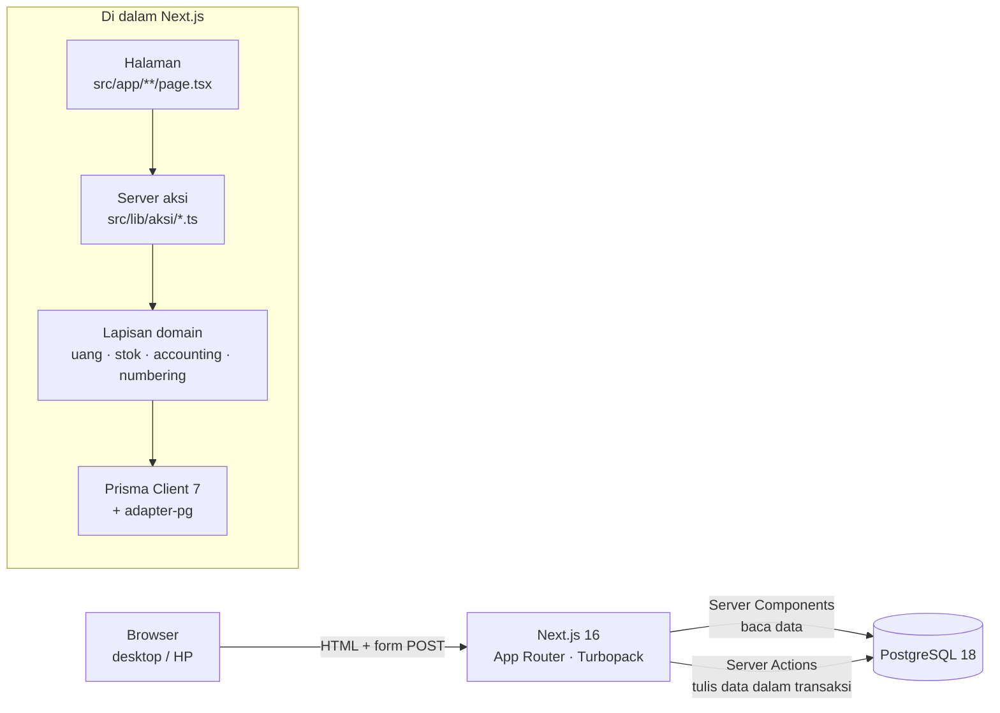
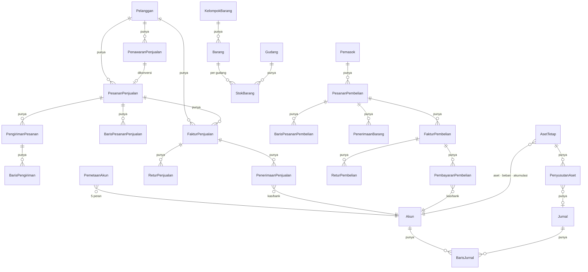
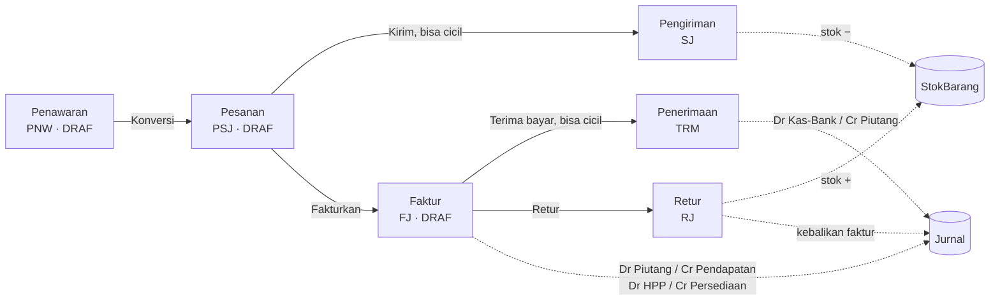
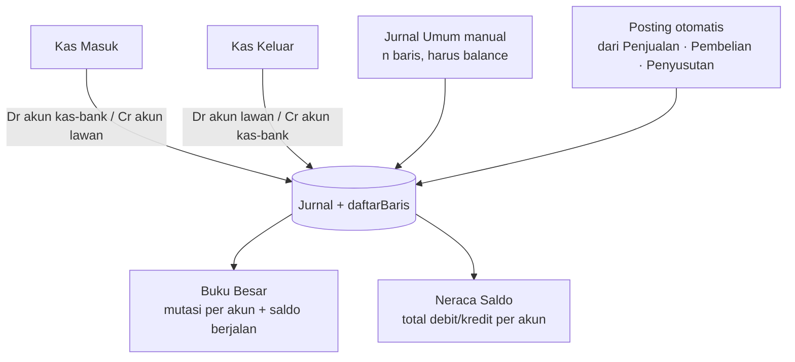
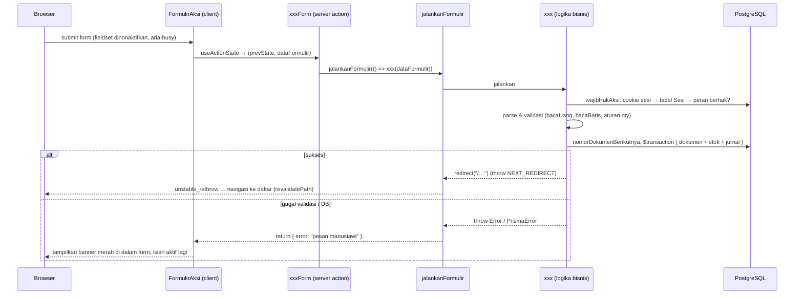

# Arsitektur Accurate Copy

Dokumen ini menjelaskan **bagaimana sistem disusun** dan **bagaimana data mengalir** dari layar sampai ke buku besar. Dibaca berurutan dari atas ke bawah: gambaran besar → struktur kode → model data → alur tiap modul → mekanisme lintas modul (penomoran, stok, jurnal, error) → operasional.

Dokumen pendamping: `README.md` (cara menjalankan & konvensi), `AUDIT.md` (temuan audit & pekerjaan terbuka).

---

## 1. Gambaran besar

Accurate Copy adalah aplikasi web internal yang meniru **alur kerja** software akuntansi Accurate 5 — bukan kodenya. Satu proses Next.js melayani UI sekaligus logika bisnis (server aksi), dengan PostgreSQL sebagai satu-satunya sumber kebenaran.



**Stack:** Next.js 16.3 (App Router, React 19 `useActionState`), TypeScript, Tailwind CSS v4, Prisma ORM 7.10 dengan driver adapter `@prisma/adapter-pg`, PostgreSQL 18.4 lokal, `tsx` untuk skrip.

**Prinsip desain yang dipegang:**

1. **Satu transaksi = satu perubahan keadaan yang utuh.** Setiap dokumen yang mengubah stok atau saldo (pengiriman, faktur, pembayaran, retur, penyusutan) dibuat di dalam `db.$transaction` bersama efek sampingnya. Tidak pernah ada faktur tanpa jurnal, atau pengiriman tanpa pengurangan stok.
2. **Server yang memvalidasi, client hanya membantu.** Semua aturan bisnis ada di server action; komponen client (`EditorBarisBarang`, dll.) cuma menyusun isian dan menampilkan preview.
3. **Angka uang & kuantitas selalu `Prisma.Decimal`** di server. `Number` hanya untuk tampilan.
4. **Error dikembalikan, bukan dilempar, ke UI.** Lihat §7.
5. **Konfigurasi di atas kode berulang** untuk master data (satu halaman generik untuk 9 entitas).

---

## 2. Struktur kode

```
app/
├─ prisma/
│  ├─ schema.prisma            # seluruh model data (§3) + Pengguna/Sesi (§6.4)
│  ├─ migrations/              # awal (semua tabel + CHECK stok), sesi_pengguna, bagan_akun, sinkron_akuntansi, pajak_perusahaan
│  ├─ seed.ts                  # 4 pengguna + bagan akun + alur cerita lewat AKSI SERVER sungguhan, diakhiri periksaSinkron
│  └─ reset.ts                 # kosongkan semua tabel (urutan aman terhadap FK)
├─ skrip/
│  ├─ uji-*.ts                 #  6 suite regresi: bagan-akun, penjualan, pembelian, buku-besar, aset-tetap, pengaman
│  └─ subset-font-ikon.sh      # pangkas font ikon ke ikon yang dipakai
├─ .github/workflows/ci.yml    # tsc · eslint · migrasi+seed di PostgreSQL · 6 suite · next build
├─ src/
│  ├─ proxy.ts                 # tepi: tanpa cookie sesi → /masuk (tanpa sentuh DB)
│  ├─ app/                     # routing (App Router)
│  │  ├─ layout.tsx            # akar: font & kanvas saja
│  │  ├─ not-found.tsx         # 404 mandiri (bisa tampil sebelum masuk)
│  │  ├─ (publik)/masuk/       # halaman masuk / pemasangan awal — tanpa kerangka aplikasi
│  │  ├─ (aplikasi)/           # semua halaman yang butuh sesi
│  │  │  ├─ layout.tsx         # penggunaSaatIni() → <KerangkaAplikasi pengguna>; tanpa sesi → /masuk
│  │  │  ├─ page.tsx           # beranda (KPI, alur dokumen, transaksi terbaru)
│  │  │  ├─ error.tsx · loading.tsx
│  │  │  ├─ data-induk/[entitas]/ (+ [id]/)   # SATU halaman generik daftar+tambah, dan ubah
│  │  │  ├─ penjualan/…        # penawaran, pesanan, pengiriman, faktur, penerimaan, retur (+ /baru)
│  │  │  ├─ pembelian/…        # pesanan, penerimaan-barang, faktur, pembayaran, retur (+ /baru)
│  │  │  ├─ kas-bank/…         # masuk, keluar
│  │  │  ├─ buku-besar/…       # jurnal (+ /baru), mutasi, neraca-saldo, laba-rugi, neraca
│  │  │  ├─ aset-tetap/…       # daftar, baru, penyusutan
│  │  │  ├─ persediaan/…       # stok per gudang, penyesuaian (+ /baru)
│  │  │  ├─ pengaturan/        # perusahaan (pajak), pemetaan-akun, bagan-akun (terapkan standar), pengguna (+ [id]/)
│  │  │  ├─ profil/ · tanpa-akses/ · cari/
│  │  └─ api/status/           # cek koneksi DB (butuh sesi)
│  ├─ komponen/
│  │  ├─ KerangkaAplikasi.tsx · BilahSamping.tsx · BilahAtas.tsx   # kerangka; menu disaring per peran (client)
│  │  ├─ FormulirAksi.tsx      # pembungkus form: galat sebagai status, pending, konfirmasi (client)
│  │  ├─ PenyusunFaktur.tsx    # form faktur dengan pratinjau jurnal (client)
│  │  ├─ data-induk/FormulirDataInduk.tsx     # form tambah/ubah dari konfigurasi entitas
│  │  ├─ penjualan/*, pembelian/*, buku-besar/*   # editor baris & pemilih (client)
│  │  └─ ui/                   # Ikon, KepalaHalaman, Lencana, KontrolDaftar (cari + paginasi), FilterPeriode
│  ├─ lib/
│  │  ├─ db.ts                 # singleton PrismaClient + adapter pg
│  │  ├─ otentikasi.ts         # sesi (cookie ↔ tabel Sesi), penggunaSaatIni, wajibMasuk/wajibHak/wajibHakAksi
│  │  ├─ hakAkses.ts           # matriks peran → hak (aman untuk komponen client), label peran
│  │  ├─ kataSandi.ts          # hash/verifikasi scrypt, aturan kekuatan
│  │  ├─ baganAkunStandar.ts   # data 108 akun EO/WO + keputusan kurasi (BAGAN-AKUN.md)
│  │  ├─ baganAkun.ts          # terapkanBaganAkunStandar (idempoten), pastikanAkunRinci, daftarAkunKasBank
│  │  ├─ sinkron.ts            # periksaSinkron: buku besar ↔ stok/piutang/hutang/barang belum ditagih
│  │  ├─ laporan.ts            # bacaPeriode, saldoAkunPeriode, hitungLabaRugi, hitungNeraca (berjenjang)
│  │  ├─ pengaturanPerusahaan.ts # PKP, tarif PPN, termin, akun pajak; bacaTarifPpn, hitungPpn, tanggalJatuhTempo
│  │  ├─ daftar.ts             # bacaParamDaftar(?q,?hal) untuk halaman daftar
│  │  ├─ dataInduk.ts          # pembacaan generik data induk (opsi, include, pencarian)
│  │  ├─ konfigurasiDataInduk.ts   # definisi entitas data induk (bidang, kolom, bagian)
│  │  ├─ uang.ts               # Decimal: D, uang, jumlahkan, kali, bacaUang, format
│  │  ├─ penomoran.ts          # nomorDokumenBerikutnya(delegasi, prefix)
│  │  ├─ stok.ts               # kurangiStok, tambahStok, perbaruiHargaRata (rata-rata bergerak), jenisBarang
│  │  ├─ akuntansi.ts          # SEMUA aturan posting jurnal otomatis per dokumen (§6.2)
│  │  ├─ statusFormulir.ts     # jalankanFormulir: galat → status, terjemahkan galat Prisma
│  │  └─ aksi/                 # "use server": penjualan, pembelian, jurnal, asetTetap, dataInduk, pengaturan, otentikasi, pengguna
│  └─ prisma-klien/            # output `prisma generate` — ikut di-commit agar tipe langsung tersedia; jangan diedit manual
├─ AUDIT.md · ARCHITECTURE.md · README.md
└─ prisma7.config.ts · .env (DATABASE_URL, tidak di-commit)
```

**Lapisan & arah ketergantungan** (hanya boleh ke bawah):

| Lapisan | Isi | Boleh mengimpor |
|---|---|---|
| Tepi (`src/proxy.ts`) | Cek keberadaan cookie sesi, alihkan ke `/masuk` | hakAkses (konstanta) saja |
| Halaman (`src/app`) | Server Components: `wajibHak`, query baca, susun props, render | komponen, lib/* |
| Komponen client (`src/komponen`) | Interaksi: editor baris, form, sidebar (disaring `punyaHak`) | tipe & `hakAkses`; **tidak** boleh `db` |
| Aksi (`src/lib/aksi`) | `wajibHakAksi`, validasi input, orkestrasi transaksi, redirect | lib/* |
| Domain (`src/lib/{uang,stok,akuntansi,penomoran,otentikasi}`) | Aturan bisnis murni yang dipakai lintas modul | lib/db, Prisma |
| Data (`src/lib/db.ts`, Prisma) | Akses DB | — |

---

## 3. Model data

Skema dibagi lima kelompok. Semua nilai uang/qty `Decimal(18,2)`; semua id `cuid`; setiap dokumen punya `nomor` unik (§5).



### 3.1 Master data (`Daftar` & `Persediaan`)
`Departemen`, `Karyawan`, `Pelanggan` (punya penjual), `Pemasok`, `Proyek`, `Gudang`, `KelompokBarang` (pohon), `Barang` (`type` BARANG/JASA, `hargaBeli`, `hargaJual`, `stokMinimum`), `Akun` (bagan akun, `type` ASET/KEWAJIBAN/MODAL/PENDAPATAN/BEBAN, pohon).

Semua dikelola oleh **satu halaman generik** `/data-induk/[entitas]` yang membaca `konfigurasiDataInduk.ts`:

```ts
{ slug: "pelanggan", label: "Pelanggan", model: "pelanggan", bagian: "daftar",
  bidang: [{ nama: "kode", jenis: "text", wajib: true }, { nama: "penjualId", jenis: "select",
            opsi: { model: "karyawan", bidangNilai: "id", bidangLabel: "nama" } }, …],
  kolom: [{ key: "kode" }, { key: "penjual.nama" }] }
```
Menambah entitas master baru = menambah satu objek konfigurasi; tidak ada halaman baru.

### 3.2 Stok
`StokBarang` berkunci komposit `(barangId, gudangId)` — stok selalu **per gudang**. Constraint DB `CHECK ("jumlah" >= 0)`. Hanya `Barang.jenis = BARANG` yang punya stok; JASA tidak pernah menyentuh stok maupun HPP. `Barang.hargaBeli` adalah **harga pokok rata-rata bergerak** yang diperbarui setiap barang masuk (Terima Barang, penyesuaian, selisih harga faktur). `PenyesuaianPersediaan` (+ baris `jumlahSebelum/jumlahSesudah/hargaSatuan`) mencatat saldo awal/opname dan berjurnal JU-PS. Barang juga bisa punya akun pendapatan/HPP/persediaan/beban sendiri (`akun*Id`, kosong = pemetaan).

### 3.3 Dokumen transaksi
Pola seragam **header + baris**: header punya `no`, `date`, `status`, `total`, relasi pihak (pelanggan/pemasok) dan relasi ke dokumen asal; baris punya `barangId`, `qty`, `price`. Baris pesanan juga menyimpan **progres**: `jumlahTerkirim`/`jumlahDiterima` dan `jumlahDifaktur` — inilah yang membuat pengiriman & penagihan bisa dicicil dan divalidasi.

Status (`StatusDokumen`): `DRAF` → `SEBAGIAN` → `DIPROSES` untuk pesanan (berdasar qty terkirim/diterima); `DRAF` → `SEBAGIAN` → `LUNAS` untuk faktur (berdasar pembayaran); `DRAF` → `DIKONVERSI` untuk penawaran.

### 3.4 Buku besar
`Akun` (`kode` unik, `nama`, `jenis` ASET/KEWAJIBAN/MODAL/PENDAPATAN/BEBAN, `indukId` pohon, `kelompok` = akun induk yang tidak boleh dijurnal, `kasBank` = tampil di pilihan kas/bank, `keterangan`). `Jurnal` (`nomor`, `tanggal`, `keterangan`, `sumber`: MANUAL/KAS_MASUK/KAS_KELUAR/PENJUALAN/PEMBELIAN/PENYUSUTAN) dan `BarisJurnal` (`akunId`, `debit`, `kredit`). Setiap jurnal **wajib seimbang** dan **hanya ke akun rinci** — dijaga di aplikasi (§6). Bagan akun standar EO/WO (108 akun) ada di `src/lib/baganAkunStandar.ts` dan diterapkan dari `/pengaturan/bagan-akun` (lihat `BAGAN-AKUN.md`). `PemetaanAkun` adalah **singleton** (`id = "default"`) yang memetakan 5 peran akun: Piutang Usaha, Persediaan, HPP, Pendapatan Penjualan, Utang Usaha.

### 3.5 Aset tetap
`AsetTetap` (harga perolehan, nilai sisa, umur bulan, 3 akun) dan `PenyusutanAset` (unik per `asetId + period`, terhubung ke jurnalnya).

---

## 4. Alur tiap modul

### 4.1 Penjualan



| Tahap | Halaman | Action | Validasi utama | Efek |
|---|---|---|---|---|
| Penawaran | `/penjualan/penawaran/baru` | `buatPenawaran` | pelanggan, ≥1 baris qty>0 | — |
| Konversi | tombol di daftar penawaran | `konversiPenawaranKePesanan` | belum `DIKONVERSI` | buat PSJ, penawaran → `DIKONVERSI` |
| Pesanan langsung | `/penjualan/pesanan/baru` | `buatPesanan` | idem penawaran | — |
| Pengiriman | `/penjualan/pengiriman/baru?pesananId=` | `buatPengiriman` | qty ≤ sisa pesanan; **stok cukup** | stok −, `jumlahTerkirim` +, status PSJ |
| Faktur | `/penjualan/faktur/baru?pesananId=` | `buatFaktur` | qty ≤ sisa belum ditagih | `jumlahDifaktur` +, **jurnal** |
| Penerimaan | `/penjualan/penerimaan/baru?fakturId=` | `buatPenerimaan` | pilih akun kas/bank; ≤ sisa tagihan; belum lunas | status faktur, **jurnal** |
| Retur | `/penjualan/retur/baru?fakturId=` | `buatRetur` | qty ≤ faktur − retur sebelumnya | stok +, **jurnal** |

Catatan desain: **stok berkurang saat pengiriman, bukan saat pesanan** (pesanan hanya reservasi logis), dan **faktur boleh mendahului pengiriman** (dua jalur, seperti Accurate).

### 4.2 Pembelian — cermin dari penjualan

```mermaid
flowchart LR
    PSB[Pesanan Pembelian<br/>PSB] -->|Terima barang, bisa cicil| TB[Penerimaan Barang<br/>TB]
    PSB -->|Fakturkan| FB[Faktur Pembelian<br/>FB]
    FB -->|Bayar, bisa cicil| BYR[Pembayaran<br/>BYR]
    FB -->|Retur| RB[Retur Pembelian<br/>RB]
    TB -.->|stok + · harga rata-rata| STK[(StokBarang)]
    RB -.->|stok − (cek cukup)| STK
    TB -.->|Dr Persediaan / Cr Barang Belum Ditagih| GL[(Jurnal)]
    FB -.->|Dr Belum Ditagih ± selisih harga · Dr Beban (jasa) / Cr Hutang| GL
    BYR -.->|Dr Hutang / Cr Kas-Bank| GL
    RB -.->|Dr Hutang / Cr Persediaan (harga pokok) ± Selisih| GL
```

Action: `buatPesananPembelian`, `buatPenerimaanBarang`, `buatFakturPembelian`, `buatPembayaranPembelian`, `buatReturPembelian` (`src/lib/aksi/pembelian.ts`). Aturan validasi identik dengan penjualan dengan arah stok terbalik. Harga default di editor baris = `hargaBeli` barang. **Terima Barang sudah menjurnal** nilai persediaan (harga pesanan) ke akun *Barang Diterima Belum Ditagih* (2-1600) agar saldo Persediaan naik bersamaan dengan stok fisik; Faktur Pembelian menutup akun itu dan memindahkan selisih harga (faktur vs pesanan) ke Persediaan sekaligus harga rata-rata. Faktur & retur juga mengubah status/sisa hutang (retur mengurangi sisa).

### 4.3 Kas & Bank dan Buku Besar



- **Saldo normal** dihitung dari tipe akun: ASET & BEBAN normal **debit** (saldo = debit − kredit); KEWAJIBAN, MODAL, PENDAPATAN normal **kredit**.
- Kas Masuk/Keluar hanyalah jurnal 2 baris dengan `source` khusus, sehingga muncul di halaman masing-masing dan tetap konsisten dengan Buku Besar.
- `Pemetaan Akun` (`/pengaturan/pemetaan-akun`) **wajib diisi** sebelum faktur/penerimaan/pembayaran/retur bisa dibuat; jika kosong, action menolak dengan pesan yang mengarahkan ke halaman itu.

### 4.4 Aset Tetap

1. Daftarkan aset (`buatAsetTetap`): harga perolehan, nilai sisa (< harga), umur bulan, 3 akun berbeda. *Perolehan tidak dijurnal otomatis* — diasumsikan sudah dicatat via Kas Keluar/Jurnal Umum.
2. `Jalankan Penyusutan` untuk satu periode `YYYY-MM` (`jalankanPenyusutanBulanan`): untuk setiap aset AKTIF yang **belum** punya penyusutan di periode itu, hitung garis lurus `(perolehan − sisa) / umur`, dibatasi sisa nilai yang bisa disusutkan (bulan terakhir mengambil sisa agar total pas), lalu buat **satu** jurnal gabungan `JU-PNY` (Dr Beban Penyusutan / Cr Akumulasi Penyusutan per aset) dan catatan `PenyusutanAset`. Unik `asetId+period` mencegah dobel-jalan.
3. Nilai buku di daftar aset = perolehan − Σ penyusutan.

---

## 5. Penomoran dokumen

`nomorDokumenBerikutnya(delegasi, prefix)` → `PREFIX-TAHUN-NNNN`, mengambil **nomor terakhir** dengan awalan itu lalu +1 (bukan `count()+1`, yang bentrok setelah ada penghapusan). Kolom `no` unik di DB, jadi bila dua request bersamaan menghasilkan nomor sama, yang kedua ditolak — bukan duplikat diam-diam.

| Prefix | Dokumen | | Prefix | Dokumen |
|---|---|---|---|---|
| PNW / PSJ / SJ / FJ / TRM / RJ | siklus penjualan | | JU · KM · KK | jurnal manual, kas masuk, kas keluar |
| PSB / TB / FB / BYR / RB | siklus pembelian | | JU-FJ · JU-TRM · JU-RJ · JU-FB · JU-BYR · JU-RB · JU-PNY | jurnal otomatis |

---

## 6. Mekanisme lintas modul

### 6.1 Stok (`src/lib/stok.ts`)
`kurangiStok(tx, barangId, gudangId, qty, label)` membaca stok di dalam transaksi, menolak bila kurang ("Stok X tidak cukup (tersedia…, diminta…)"), lalu `decrement`. Pengaman balapan: `CHECK (qty >= 0)` di DB — bila dua transaksi lolos cek aplikasi bersamaan, yang kedua gagal dan seluruh transaksinya di-rollback; pesannya diterjemahkan oleh `statusFormulir.ts`. `tambahStok` memakai `upsert` (baris stok dibuat saat pertama kali ada barang masuk ke gudang itu). `jenisBarang` dipakai semua dokumen untuk melewati baris JASA. `perbaruiHargaRata(tx, barangId, qtyMasuk, hargaMasuk, stokSudahTermasuk)` menghitung rata-rata bergerak dari seluruh stok barang (lintas gudang); `sesuaikanHargaRata` menyebar selisih nilai (mis. harga faktur ≠ pesanan) ke harga pokok. Karena setiap barang keluar dinilai dengan harga rata-rata yang sama, **Σ stok × hargaBeli = saldo akun Persediaan** (toleransi pembulatan 2 desimal).
**Pindah Barang** (`PindahBarang`, PB-TAHUN-NNNN, `buatPindahBarang` di `src/lib/aksi/persediaan.ts`): `kurangiStok` di gudang asal + `tambahStok` di gudang tujuan dalam satu transaksi; harga pokok rata-rata berlaku per barang untuk semua gudang, jadi nilai persediaan tidak berubah dan tidak ada jurnal. Menghapusnya membalik perpindahan — ditolak bila stok di gudang tujuan sudah terpakai.

### 6.2 Posting jurnal otomatis (`src/lib/akuntansi.ts`)

Sebelum baris jurnal ditulis, `pastikanAkunRinci` (`src/lib/baganAkun.ts`) menolak akun bertanda `kelompok` — berlaku untuk jurnal otomatis ini, jurnal umum, kas masuk/keluar, penyusutan, dan pemetaan akun.

| Peristiwa | Debit | Kredit |
|---|---|---|
| Surat Jalan (JU-SJ) | Barang Terkirim Belum Ditagih (qty × harga pokok saat kirim, BARANG saja); bagian yang fakturnya sudah lebih dulu terbit langsung ke HPP | Persediaan per akun |
| Uang Muka Pelanggan (JU-UM) | Akun kas/bank yang dipilih | Uang Muka Pelanggan (kewajiban; DP atas pesanan) |
| Faktur Penjualan (JU-FJ) | Piutang Usaha (DPP + PPN − uang muka dipakai) · Uang Muka Pelanggan (DP pesanan yang dipakai, FIFO) · HPP per akun (harga pokok dari baris surat jalan yang dikonsumsi FIFO; bila belum dikirim, dari rata-rata saat itu) | Pendapatan per akun barang/pemetaan (DPP) · PPN Keluaran (bila PKP) · Barang Terkirim Belum Ditagih (bagian yang sudah dikirim) |
| Penerimaan Penjualan (JU-TRM) | Akun kas/bank yang dipilih · Pajak Dibayar Dimuka (potongan PPh 23 oleh klien) | Piutang Usaha (bayar + potongan) |
| Retur Penjualan (JU-RJ) | Pendapatan per akun (harga faktur) · PPN Keluaran (proporsional tarif faktur) · Persediaan (harga pokok) | Piutang Usaha (DPP + PPN retur) · HPP |
| Terima Barang (JU-TB) | Persediaan per akun (qty × harga pesanan, BARANG) | Barang Diterima Belum Ditagih |
| Faktur Pembelian (JU-FB) | Barang Diterima Belum Ditagih (harga pesanan) · Persediaan (selisih harga, bisa kredit) · Beban jasa per akun (JASA) · PPN Masukan (bila PKP) | Hutang Usaha (DPP + PPN) |
| Pembayaran Pembelian (JU-BYR) | Hutang Usaha (bayar + potongan) | Akun kas/bank yang dipilih · Hutang PPh 23 (potongan yang kita lakukan) |
| Retur Pembelian (JU-RB) | Hutang Usaha (DPP + PPN retur) · Selisih Persediaan (bila rugi) | Persediaan (harga pokok) · Beban jasa (JASA) · PPN Masukan (proporsional) · Selisih Persediaan (bila untung) |
| Penyesuaian Stok (JU-PS) | Persediaan (selisih × harga satuan; kredit bila turun) | Akun lawan: Modal (saldo awal) / Selisih Persediaan (opname) |
| Perolehan Aset (JU-AT) | Akun aset tetap | Kas/Bank atau Hutang yang dipilih (opsional) |
| Penyusutan (JU-PNY) | Beban Penyusutan (per aset) | Akumulasi Penyusutan (per aset) |

Semua posting terjadi **di dalam transaksi yang sama** dengan dokumen sumbernya, keterangan jurnal memuat nomor dokumen, dan `catatJurnal` menolak jurnal tidak seimbang atau ke akun kelompok. Data seed memanggil aksi server yang sama sehingga jurnal contoh identik dengan yang dibuat pengguna. Setiap dokumen menyimpan `jurnalId` jurnal otomatisnya (unik) supaya bisa dibalik saat dokumen dihapus.

### 6.2a Hapus / ubah dokumen (`src/lib/aksi/hapusDokumen.ts`)
Tidak ada halaman *edit* dokumen transaksi — mengubah berarti **hapus lalu buat ulang**, karena satu dokumen memengaruhi stok, harga pokok rata-rata, progres dokumen induk, dan jurnal sekaligus. `hapusDokumen(jenis, id)` (hak `dokumen.hapus`, Pemilik & Admin) dalam satu `$transaction`: (1) menolak bila masih punya turunan — pesanan yang sudah dikirim/difaktur/punya uang muka, surat jalan yang fakturnya terbit setelahnya, faktur yang sudah diterima bayarannya/diretur atau bukan faktur terakhir pesanannya, faktur pembelian yang sudah dibayar/diretur, aset yang sudah disusutkan, penyusutan yang bukan periode terakhir, jurnal selain MANUAL/KAS_MASUK/KAS_KELUAR, pindah barang yang stok tujuannya sudah terpakai; (2) membalik stok dan nilai persediaan (`tambahStok`/`kurangiStok` + `ubahNilaiStok` supaya rata-rata kembali); (3) mengurangi progres `jumlahTerkirim`/`jumlahDifaktur`/`jumlahDiterima` (konsumsi baris surat jalan dilepas LIFO) dan mengembalikan uang muka yang dipakai faktur (`PemakaianUangMuka`); DP yang sudah terpakai ditolak dihapus sebelum fakturnya; (4) menghapus jurnal lewat `jurnalId`; (5) menghitung ulang status faktur/pesanan; (6) mencatat ke `LogAktivitas` (siapa, kapan, jenis, nomor) yang tampil di **Pengaturan → Log Aktivitas**. Baris SJ/TB/retur menyimpan `hargaPokok`/`hargaSatuan` saat terjadi agar pembalikan memakai nilai yang sama dengan jurnalnya.

### 6.2b Sinkronisasi buku besar (`src/lib/sinkron.ts`)
`periksaSinkron` mencocokkan saldo buku besar dengan sumber lain: Persediaan ↔ Σ stok × harga pokok; Piutang ↔ Σ (total faktur − uang muka dipakai − penerimaan − retur); Uang Muka Pelanggan ↔ Σ (DP diterima − dipakai); Hutang ↔ Σ (total faktur pembelian − pembayaran − retur); Barang Diterima Belum Ditagih ↔ Σ (diterima − difaktur) × harga pesanan; Barang Terkirim Belum Ditagih ↔ Σ (dikirim − difaktur) × harga pokok saat kirim; plus Σ debit = Σ kredit. Dipakai kartu *Integritas & Sinkronisasi* di beranda, halaman Stok per Gudang, akhir seed (gagal = seed berhenti), dan `skrip/uji-sinkron.ts` (dijalankan terakhir di CI). Selisih ≠ 0 = ada jalur yang tidak menjurnal atau menjurnal ganda — diperlakukan sebagai bug, bukan dibiarkan.

### 6.2c Laporan keuangan (`src/lib/laporan.ts`)
`saldoAkunPeriode` mengagregasi `BarisJurnal` per akun dalam rentang tanggal (`groupBy`), lalu `susunHierarki` membuat baris berjenjang dengan subtotal kelompok. **Laba Rugi** = pendapatan − beban pokok (kelompok akar yang memuat akun HPP dari pemetaan) = laba kotor, − beban lain = laba bersih. **Neraca** per tanggal: aset, kewajiban, ekuitas (akun), plus dua baris hitungan — laba tahun-tahun sebelumnya (jurnal sebelum 1 Januari tahun tanggal laporan) dan laba tahun berjalan — sehingga Aset = Kewajiban + Ekuitas tanpa jurnal penutup. Neraca Saldo memakai filter periode yang sama.

### 6.2d Pajak (`src/lib/pengaturanPerusahaan.ts`)
`PengaturanPerusahaan` (singleton) menyimpan nama, `pkp`, `tarifPpnPersen`, `terminHari`, dan empat akun pajak. `bacaTarifPpn` menolak PPN > 0 bila non-PKP; `hitungPpn` membulatkan 2 desimal; faktur menyimpan `dpp`, `ppnPersen`, `ppn`, `total = dpp + ppn`, retur menyimpan `dpp`/`ppn` proporsional tarif faktur. `potonganPajak` pada Penerimaan/Pembayaran mengurangi piutang/hutang bersama nominal bayar (dipakai `periksaSinkron`, status faktur, dan KPI). Nama perusahaan dari pengaturan yang sama tampil di sidebar.
**Ringkasan pajak & PPh Final** (`src/lib/pajak.ts`, `src/lib/aksi/pajak.ts`): `ringkasanPajak(klien, tahun, tarif)` mengagregasi per bulan dari dokumen (FJ/RJ `dpp`+`ppn`, FB/RB `ppn`, TRM/BYR `potonganPajak`) dan menghitung PPh Final = omzet × tarif (`PengaturanPerusahaan.pphFinalPersen`). `catatPphFinal(periode)` membuat jurnal `JU-PPHF` (sumber `PAJAK`; Dr `akunBebanPphFinalId` / Cr `akunHutangPphFinalId`, tanggal akhir bulan, dijaga `pastikanTahunTerbuka`) dan catatan `PphFinalBulanan` (periode unik, omzet & tarif saat dicatat); dihapus lewat `hapusDokumen("pphFinal")`. Penyetoran ke DJP = Kas Keluar biasa ke akun hutangnya.

### 6.2e Tahun buku
`PengaturanPerusahaan.tahunBuku` (kosong = tahun kalender) adalah tahun yang sedang dibuka. `ambilPengaturanPerusahaan` mengembalikannya sudah terselesaikan; `bacaPeriode(param, tahunBuku)` memakainya sebagai bawaan laporan (sampai hari ini bila tahun berjalan, selain itu sampai 31 Des) dan `FilterPeriode` membuat pintasannya. Kartu perusahaan di sidebar (`<details>`) menampilkan mata uang (tunggal, Rupiah), pemilih tahun (aksi `gantiTahunBuku`, hak `pengaturan.tulis`; daftar tahun = tahun yang punya jurnal ± 1 tahun dari sekarang), dan pintasan Laba Rugi/Neraca tahun itu. Penomoran dokumen tetap memakai tanggal transaksi.

### 6.2f Tutup buku & kunci tahun (`src/lib/tutupBuku.ts`, `src/lib/aksi/tutupBuku.ts`)
`tutupTahun(tahun)` (hak `buku-besar.tulis`): `ringkasanPenutupan` mengambil saldo tiap akun pendapatan/beban rinci tahun itu (tanpa jurnal penutup), lalu satu jurnal `JU-TUTUP` (sumber `PENUTUP`, tanggal 31 Des 23:59:59) mendebit pendapatan, mengkredit beban, dan mengkredit/mendebit Laba Ditahan (`PemetaanAkun.labaDitahanId`) sebesar laba/rugi bersih; catatan `TutupBuku` (tahun unik, laba, pengguna, jurnal). Bila tahun yang ditutup = tahun buku aktif, `tahunBuku` maju satu. `pastikanTahunTerbuka(klien, tanggal)` dipanggil `catatJurnal`, `buatJurnalSeimbang`, penyusutan, dan `hapusJurnal` (hapus dokumen) — jadi tahun yang ditutup tidak bisa menerima maupun kehilangan jurnal. `bukaKembaliTahun` menghapus jurnal penutup & catatannya. `saldoAkunPeriode(..., tanpaPenutup)`: Laba Rugi dan Neraca Saldo mengabaikan `PENUTUP`; Neraca menyertakannya (laba tahun tertutup tampil di akun Laba Ditahan, sisanya tetap dihitung dari jurnal).

### 6.2g Laporan arus kas (`src/lib/arusKas.ts`)
Metode langsung dari jurnal: semua jurnal berperiode yang punya baris akun `kasBank` diambil; untuk tiap baris **bukan** kas/bank, `kredit − debit` = kas masuk (negatif = keluar), dikumpulkan per akun lawan dan diklasifikasikan `kelasArus`: MODAL & kewajiban `2-2xxx` → pendanaan; aset `1-2xxx`/`1-3xxx` → investasi; lainnya → operasi. Perpindahan antar kas/bank saling meniadakan. Karena tiap jurnal seimbang, kas awal + Σ arus = saldo kas/bank buku besar — dicek (`cocok`) dan ditampilkan.

### 6.3 Uang & kuantitas (`src/lib/uang.ts`)
`uang()` membulatkan ke 2 desimal half-up; `bacaUang()` memvalidasi isian form (wajib, angka valid, tidak negatif, default > 0); `jumlahkan`/`kali` mengembalikan Decimal. Perbandingan status (mis. lunas) memakai `.gte()`, bukan `>=` float.

### 6.4 Otentikasi & hak akses (`src/lib/otentikasi.ts`, `src/lib/hakAkses.ts`, `src/proxy.ts`)

Tanpa pustaka luar dan tanpa kunci rahasia di `.env`:

- **Kata sandi**: scrypt (Node `crypto`) dengan garam acak 16 byte per pengguna, disimpan sebagai `scrypt$garam$hash`; aturan minimal 8 karakter berisi huruf & angka.
- **Sesi berbasis basis data**: saat masuk dibuat token acak 256-bit; cookie `sesi_ac` (httpOnly, SameSite=Lax, 30 hari) menyimpan tokennya, tabel `Sesi` menyimpan SHA-256-nya. Mencabut sesi = menghapus barisnya — dipakai saat keluar, ganti kata sandi (semua perangkat lain keluar), akun dinonaktifkan, atau peran diubah.
- **Tiga lapis pemeriksaan**:
  1. `proxy.ts` — hanya melihat *ada/tidaknya* cookie: tanpa cookie → `/masuk?kembali=…` (juga menahan prefetch), `/api/*` → 401. Tidak menyentuh DB.
  2. `(aplikasi)/layout.tsx` — `penggunaSaatIni()` (di-`cache` per render): token dicocokkan ke tabel, kedaluwarsa & `aktif` dicek → kerangka dipasang dengan identitas pengguna, atau dialihkan ke `/masuk`.
  3. **Setiap halaman** memanggil `wajibHak("modul.lihat")` dan **setiap aksi server** memanggil `wajibHakAksi("modul.tulis")` sebagai pernyataan pertama. Halaman mengalihkan ke `/tanpa-akses`; aksi melempar galat yang tampil di formulir (isian tidak hilang).
- **Hak per dokumen** (`hakAkses.ts`, boleh diimpor komponen client): `DOKUMEN_HAK` mendaftar 22 jenis dokumen dengan aksi `lihat`/`buat`/`hapus` (mis. `faktur.buat`, `pengiriman.hapus`), ditambah 9 hak modul (`data-induk.lihat|tulis`, `persediaan.lihat`, `buku-besar.lihat|tulis`, `pengaturan.tulis`, `pengguna.kelola`, `log-aktivitas.lihat`, `hak-akses.kelola`). `HAK_BAWAAN` per peran: Superadmin & Pemilik penuh dan tak bisa dikurangi (`PERAN_TERTINGGI`); Admin semua kecuali `hak-akses.kelola`; Kasir membuat dokumen keuangan & melihat semuanya; Gudang SJ/TB/stok. **Penyesuaian** disimpan di tabel `HakAksesPeran` (peran, hak, boleh) hanya sebagai selisih dari bawaan; `penggunaSaatIni` menghitung `hak` efektif tiap permintaan (`hitungHak`) sehingga perubahan di Pengaturan › Hak Akses langsung berlaku. `punyaHak(sesi, hak)` memakai hak efektif; `punyaHak(peran, hak)` memakai bawaan. Menghapus dokumen memakai `HAK_HAPUS[jenis]` (jurnal menurut sumbernya). Sidebar, menu Transaksi Baru, dan tombol aksi di daftar disaring dengan `punyaHak` — itu kenyamanan, bukan pengaman.
- **Kelola pengguna** (`/pengaturan/pengguna`): identitas masuk = **nama pengguna** (`Pengguna.namaPengguna`, unik, huruf kecil; email hanya kontak opsional); Admin tidak bisa menyentuh akun Superadmin/Pemilik; peran/status akun sendiri tidak bisa diubah; minimal satu Superadmin/Pemilik aktif harus tersisa; hapus akun melepas tautan `Karyawan.penggunaId` (riwayat transaksi tidak terhapus).
- **Skrip regresi** memanggil aksi server tanpa HTTP; `cookies()` melempar galat di luar permintaan, dan `penggunaSaatIni` mengembalikan pengguna sintetis Pemilik hanya bila `UJI_TANPA_SESI=1` **dan** `NODE_ENV !== "production"`.

---

## 7. Siklus hidup satu request (form → DB → layar)



Mengapa dua versi action (`buatFaktur` dan `buatFakturFormulir`)? Di production Next.js **menyamarkan** pesan error yang dilempar server action (anti-bocor data). Satu-satunya cara pesan validasi sampai ke user adalah **mengembalikannya sebagai keadaan**. Versi tanpa akhiran `Form` tetap dipakai skrip regresi (yang justru ingin exception).

Halaman **daftar** adalah Server Component: `wajibHak` → `bacaParamDaftar(searchParams)` → `count` + `findMany({ where, skip, take })` langsung ke Prisma, tanpa lapisan API; `<KontrolDaftar>` merender kotak cari (`<form method="get">`) dan tautan halaman — semuanya tanpa JavaScript klien. `revalidatePath` di aksi membuat daftar segar setelah redirect. Halaman **buat** memuat opsi (pelanggan, barang, gudang) di server dan menyerahkan isian dinamis ke komponen client yang menyimpan baris sebagai JSON di `<input type="hidden" name="baris">`. Halaman **ubah** data induk (`/data-induk/[entitas]/[id]`) memakai `FormulirDataInduk` yang sama dengan form tambah, diisi nilai awal.

Boundary: `error.tsx` (kegagalan render, tombol coba lagi), `not-found.tsx` (404 mandiri, juga untuk `notFound()` dari entitas yang tidak dikenal), `loading.tsx` (kerangka saat navigasi), `tanpa-akses` (peran tidak berhak).

---

## 8. Antarmuka

Tampilan mengikuti design system **"Precision Ledger"** dari paket Stitch (`DESIGN.md` + 2 layar contoh: Beranda dan form Faktur). Implementasinya ada di `src/app/globals.css` (token & kelas komponen) dan `src/komponen/{KerangkaAplikasi,BilahSamping,BilahAtas,PenyusunFaktur,ui/*}`.

- **Token:** kanvas `#f8fafc`; kartu putih `rounded-2xl` border `slate-200/70` + bayangan sangat halus; Inter (teks), Hanken Grotesk (judul), JetBrains Mono (angka & nomor dokumen, `tabular-nums`). Sinyal finansial: emerald = kredit/lunas, rose = debit/jatuh tempo, amber = draft/menunggu, blue = aksi/aktif.
- **Kelas komponen** (dipakai semua halaman, bukan utility per elemen): `.kartu`/`.kartu-tabel`/`.kepala-kartu`/`.ubin`, `.tombol` + `tombol-utama|aksen|garis|lembut|bahaya|kecil`, `.isian`/`.isian-kecil`/`.label`/`.petunjuk`/`.bidang`, `.tabel` (header uppercase 11px, baris 40px, hover) / `.tabel-polos`, `.lencana-*`, `.lencana-dokumen`, `.angka`/`.mono`/`.teks-label`. Komponen kecil: `NomorDokumen` (lencana prefix + nomor mono), `LencanaStatus`, `Ikon` (Material Symbols), `KontrolDaftar` (cari + paginasi).
- **Kerangka:** `KerangkaAplikasi` (client, menerima `pengguna` dari layout) = `BilahSamping` tetap 16rem di desktop / *drawer* di mobile + `BilahAtas` lengket (pencarian ⌘K → `/cari`, menu "Transaksi Baru", menu akun: nama, peran, Profil, Keluar) + `<main max-w-7xl>`. Halaman `/masuk` dirender tanpa kerangka (grup rute `(publik)`).
- **Navigasi:** Beranda, lalu grup **Operasional** (Penjualan, Pembelian, Kas & Bank, Buku Besar, Aset Tetap) dan **Administrasi & Pengaturan** (Data Induk, Pemetaan Akun, Pengguna). Setiap tautan punya `hak`; grup yang tak punya tautan tersisa untuk peran itu disembunyikan. Accordion satu-terbuka; grup yang memuat halaman aktif terbuka otomatis (keadaan di-reset via `key={pathname}` tanpa `useEffect`); sub-menu menampilkan kode dokumen (PNW, PSJ, SJ, …).
- **Beranda & form Faktur** dibangun ulang mengikuti layar Stitch dengan data sungguhan: KPI (piutang, utang, kas & bank, nilai persediaan), pipeline PNW→PSJ→SJ→FJ→TRM, transaksi terbaru gabungan, neraca saldo cepat, peringatan stok, status penyusutan; `PenyusunFaktur` menampilkan ringkasan finansial, **preview jurnal otomatis** (dari pemetaan akun), dan guardrails secara live saat qty diubah.
- **Ikon:** Material Symbols Outlined di-self-host (`src/app/fonts/…woff2`) lewat `next/font/local` — tidak ada request ke Google saat runtime. File-nya sudah di-**subset** ke ±47 ikon yang dipakai (< 50 KB, dari 3,9 MB) dengan `skrip/subset-font-ikon.sh` (pyftsubset; ligatur `rlig/rclt` dipertahankan agar `<span>home</span>` tetap jadi ikon). Menambah ikon baru = jalankan ulang skrip itu.
- **Responsif:** form `grid-cols-1 md:grid-cols-2`; elemen lebar penuh `md:col-span-2`; setiap tabel dalam `.kartu-tabel > .bungkus-tabel` (scroll horizontal di HP, halaman tidak ikut melebar).
- **Tema:** satu tema terang (`color-scheme: light`) sesuai DESIGN.md; dark mode sengaja tidak didukung.

---

## 9. Data uji & regresi

- `prisma/seed.ts` — 4 pengguna, bagan akun standar EO/WO, lalu **satu alur cerita** 20 tahap berlatar usaha event (klien PT Cahaya Nusantara, vendor CV Sinar Dekorasi, merchandise lanyard/stiker/goodie bag, aset sound system) yang menyentuh semua halaman: penawaran draft → dikonversi → pesanan → 2 pengiriman → faktur → 2 penerimaan → retur; restock via pembelian penuh; modal awal, setor bank, bayar sewa; aset + satu penyusutan. Angka akhirnya deterministik (mis. stok Lanyard 127, Kas 6.500.000) sehingga mudah dicek manual.
- `prisma/reset.ts` — hapus semua tabel dalam urutan aman FK.
- `skrip/uji-penjualan*.ts` — memanggil action **sungguhan** dengan `FormData`, memverifikasi stok/status/saldo, lalu membersihkan datanya sendiri (jurnal dihapus berdasarkan waktu mulai test, bukan memo). Suite `pengaman` khusus menguji penolakan: stok kurang, qty melebihi pesanan/faktur/retur, bayar berlebih, faktur lunas, presisi desimal (3×0,1 = 0,3), dan constraint DB.

---

## 10. Operasional

- **DB lokal:** `~/Cooking/PostgreSQL/pgctl.sh start|stop|status`; database `accurate_copy`; koneksi di `.env` (`DATABASE_URL`, tidak di-commit). Tidak ada rahasia lain.
- **Pemasangan awal:** basis data tanpa pengguna → `/masuk` menampilkan formulir pembuatan akun Pemilik pertama. Data contoh (`seed.ts`) membuat 6 akun (`superadmin`, `owner`, `owner2`, `admin`, `kasir`, `gudang`; kata sandi = nama peran + `123`, lihat README).
- **Ubah skema:** edit `prisma/schema.prisma` → `npx prisma migrate dev --name … --config prisma7.config.ts` → **restart `npm run dev`** (Turbopack tidak memuat ulang Prisma Client yang di-generate ulang; gejalanya `Cannot read properties of undefined (reading 'findMany')`). Constraint yang tidak didukung Prisma (mis. `CHECK`) ditulis manual di file migrasi (`--create-only`).
- **Sebelum commit:** `npx tsc --noEmit && npx eslint && for s in skrip/uji-*.ts; do npx tsx $s; done` — hal yang sama dijalankan CI (`.github/workflows/ci.yml`) di PostgreSQL 16 sekali pakai, ditambah `next build`.
- **Menambah ikon:** `skrip/subset-font-ikon.sh` (butuh `pip install fonttools brotli`).
- **Repo:** `github.com/dreinst/accuratecopy` (folder `app/` saja).

---

## 11. Batas & arah pengembangan

Belum ada: halaman *edit* dokumen transaksi (pola sekarang: hapus lalu buat ulang), hak akses per gudang/pelanggan (sekarang per dokumen & peran), lupa-kata-sandi lewat email & pembatasan percobaan masuk, PPh badan tarif umum & ekspor CSV/e-Faktur/e-Bupot (ringkasan SPT, PPN, PPh 23, PPh Final sudah), Proyek sebagai dimensi transaksi, e-Faktur (butuh integrasi DJP), metode penyusutan selain garis lurus, pelepasan aset. Daftar lengkap & prioritasnya: `AUDIT.md` bagian **[OPEN]**.

Cara menambah modul baru mengikuti pola yang sudah ada: model + migrasi → aksi (`xxx` + `xxxFormulir`) yang diawali `wajibHakAksi` lalu validasi & `$transaction` → aturan posting di `akuntansi.ts` bila menyentuh uang → halaman daftar (`wajibHak`, `bacaParamDaftar`, `KontrolDaftar`) + halaman buat dengan `FormulirAksi` → tambahkan hak baru di `hakAkses.ts` bila perlu dan tautan (dengan `hak`) di `BilahSamping.tsx` → suite regresi.
